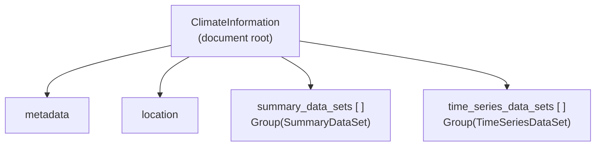
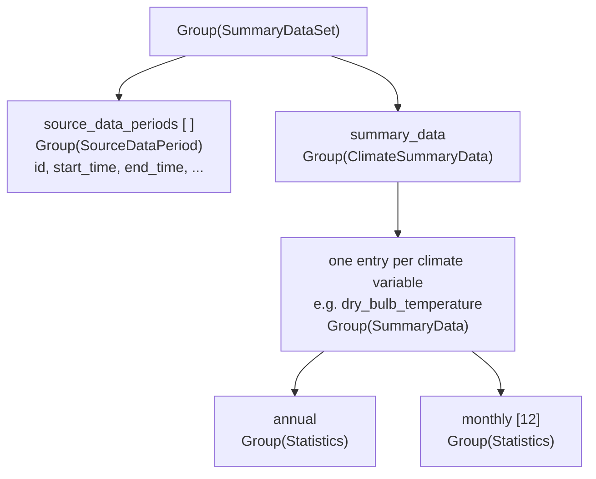
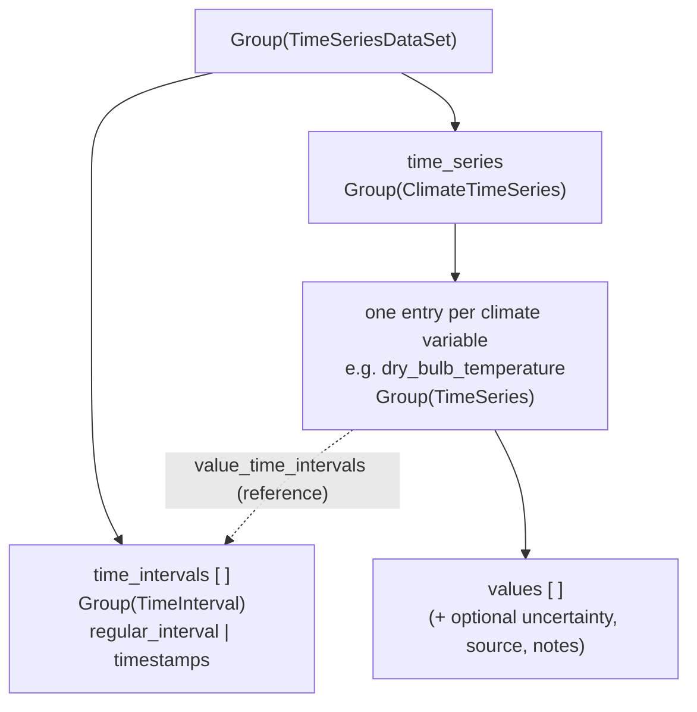

# Climate Information Data Model -- Implementation & Application Notes

A companion to `schema/ClimateInformation.schema.yaml` and the worked examples in
`examples/`. It explains how the data model is structured, the special-case
conventions it uses, the unit system, and how two widely used external climate
formats -- the ASHRAE Handbook of Fundamentals (HOF) design conditions and the
EnergyPlus Weather / TMY format -- map onto it.

> This is a *companion / design* document, **not** the normative specification. The
> schema YAML is normative; the published specification is generated from it (see
> `docs/`). Design questions still to be resolved before publication are tracked in
> `docs/open_questions_before_publishing.md`. The raw running list of committee
> questions and decisions is in `docs/notes_with_json_example.cleaned.md`. The
> column-level cross-check against the external formats is in
> `docs/ashrae_dd_gap_analysis.md`.

---

## 1. How the model is structured

A climate-information document is a single JSON object -- `ClimateInformation` in the
schema -- with four top-level members:

| Member | Purpose |
|---|---|
| `metadata` | Document-level provenance: schema id/version, description, timestamps, copyright/licence. |
| `location` | The weather station: identifiers, coordinates, elevation, time zone, climate-zone classifications. |
| `summary_data_sets` | One or more **statistical summaries** of the climate (means, extremes, exceedance/design conditions, degree days, ...). |
| `time_series_data_sets` | One or more **time series** (e.g. an hourly typical year). |

> **`metadata` is defined externally.** `ClimateInformation.metadata` is typed
> `Group(Metadata)`, but the `Metadata` group itself is **defined by ASHRAE Standard 232**
> and is intentionally *not* redefined in this schema. The schema only references it and
> constrains its `schema_name` to `CLIMATE_INFORMATION`; see the note on the `metadata`
> element in `schema/ClimateInformation.schema.yaml`.



The two data-set families are deliberately **parallel**: each pairs a *time base*
with a *named set of climate variables*, and each variable drills down to the actual
numbers. A summary variable bottoms out in a `Statistics` block; a time-series
variable bottoms out in an array of `values`. Sections 1.1-1.4 walk down each branch;
section 1.5 lines them up side by side.

### 1.1 Summary data sets

A `SummaryDataSet` carries:

- `source_data_periods` -- an array of `SourceDataPeriod` (`id`, `start_time`,
  `end_time`, `notes`, `ashrae_grade`). Different variables can reference different
  periods by `id` -- e.g. solar quantities often use a shorter period of record than
  temperature.
- `summary_data` -- a `ClimateSummaryData` group whose members are the individual
  climate variables (dry-bulb temperature, wind speed, precipitation, degree days, ...).
- `notes` -- optional supplementary text.

Each ordinary variable in `summary_data` is a `SummaryData` group:

```jsonc
"dry_bulb_temperature": {
  "display_name": "Dry-bulb temperature",
  "units": "K",
  "source_data_period": "period-of-record-1",   // -> a SourceDataPeriod.id
  "source_data_type": "MEASURED",                // MEASURED | MODELED
  "annual":  { /* Statistics */ },
  "monthly": [ /* 12 x Statistics, January ... December */ ]
}
```



A few members of `ClimateSummaryData` do not follow the `SummaryData` shape (degree
days are arrays; the hottest/coldest-month indices are plain integers). Those are
covered in section 4.

### 1.2 The `Statistics` block (the leaf of a summary)

`Statistics` is a **generic distribution summary** for one variable over one period
(the `annual` block, or one of the 12 `monthly` blocks). It is intentionally not a
fixed list of named design points; a provider populates whichever members it has:

- **Central tendency / spread** -- `mean`, `standard_deviation`.
- **Annual extremes** -- `mean_minimum`, `mean_maximum`, `standard_deviation_minimum`,
  `standard_deviation_maximum`: the mean and standard deviation of the *per-year*
  minima and maxima over the source period.
- **Single observed extremes** -- `maximum`, `minimum`: the highest / lowest single
  value seen in the period.
- **`percent_exceedance`** -- a distribution stored as a **grid + lookup** pair:

```jsonc
"percent_exceedance": {
  "grid_variables":   { "percent_time_exceeded": [0.4, 1.0, 2.0, 99.0, 99.6] },
  "lookup_variables": { "values":                [306.05, 304.65, 303.25, 257.85, 255.05] }
}
```

`values[i]` is the threshold the variable exceeds `percent_time_exceeded[i]` % of the
time. A **low** percentage names a value exceeded only rarely (a hot / high extreme); a
**high** percentage names a value exceeded almost all the time (a cold / low extreme).
Because the percentiles are stored as *data* rather than as schema keys, a provider can
publish any set of exceedance levels without a schema change.

> Coincident variables (where the lookup carries the *coincident* value of a second
> variable) use a related grid/lookup form -- see section 4.1.

### 1.3 Time series data sets

A `TimeSeriesDataSet` is the time-series counterpart of a `SummaryDataSet`:

- `time_intervals` -- an array of `TimeInterval` (`id`, plus either a `regular_interval`
  in seconds **or** an explicit `timestamps` array; optional `starting_time`, `labels`,
  `notes`). Variables reference an interval by `id`.
- `time_series` -- a `ClimateTimeSeries` group whose members are the individual
  climate variables.
- `notes` -- optional supplementary text.

Each variable in `time_series` is a `TimeSeries` group: `display_name`, `units`, a
`value_type` (`INSTANTANEOUS` | `AVERAGE` | `SUM` | `CUMULATIVE`), a
`value_time_intervals` reference to one `TimeInterval`, and the `values` array itself.
Optional parallel arrays -- `uncertainty`, `source`, `notes` -- may each be aligned to
their own interval (`uncertainty_time_intervals`, etc.).



### 1.4 Summaries and time series are parallel

| Summary branch | Time-series branch | Role |
|---|---|---|
| `SummaryDataSet` | `TimeSeriesDataSet` | one statistical summary / one time series |
| `source_data_periods[]` -> `SourceDataPeriod` | `time_intervals[]` -> `TimeInterval` | the time base referenced by variables, by `id` |
| `summary_data` -> `ClimateSummaryData` | `time_series` -> `ClimateTimeSeries` | the named set of climate variables |
| a variable -> `SummaryData` | a variable -> `TimeSeries` | one climate variable |
| `annual` / `monthly[12]` -> `Statistics` | `values[]` aligned to a `TimeInterval` | the actual numbers (the leaf) |

The two families share the same variable vocabulary where it makes sense (e.g.
`dry_bulb_temperature`, `wind_speed`, `liquid_precipitation_depth` appear on both
sides), so a document can hold an hourly record and the statistical summary derived
from it under one `location`.

---

## 2. From time series to summaries -- what this version adds

The data model began as a **time-series** weather model: the `ClimateTimeSeries`
variable set (temperature, humidity, the solar irradiance/irradiation family, wind,
sky cover, precipitation, and a broad air-quality/pollutant list) describes an hourly
or sub-hourly record for a station. That side is mature and is unchanged here.

**This version adds the summary / design-data side**: the `ClimateSummaryData` and
`Statistics` groups (section 1.2), so the same document can carry both the raw record and the
statistical and design summaries derived from it. Concretely, this version introduces:

**Schema (`ClimateInformation.schema.yaml`)**

- `location.wmo_region` (Integer 1-6).
- `Statistics.maximum` and `Statistics.minimum` (single observed extremes).
- New `ClimateSummaryData` variables: `wet_bulb_temperature`, `wind_speed`,
  `enthalpy`; the coincident variables
  `dew_point_temperature_coincident_mean_dry_bulb_temperature`,
  `wet_bulb_temperature_coincident_mean_dry_bulb_temperature`,
  `dry_bulb_temperature_coincident_prevailing_wind_direction`,
  `enthalpy_coincident_mean_dry_bulb_temperature`,
  `wind_speed_coincident_mean_dry_bulb_temperature`;
  `clear_sky_beam_optical_depth`, `clear_sky_diffuse_optical_depth`,
  `daily_all_sky_solar_irradiation`; the five `daily_*_temperature_range*` variables;
  and the `coldest_month` / `hottest_month` indices.

**Nothing was removed.** Time-series variables already present but outside any design
table (e.g. the air-quality and illuminance variables) were left in place.

**Examples**

- `examples/USA_IL_Chicago-v2.1-draft.json` -- a full summary for Chicago O'Hare
  (WMO 725300).
- `examples/GBR_Scotland_Glasgow-Bishopton-v2.1-draft.json` -- Glasgow Bishopton
  (WMO 03134).
- `examples/generated/` -- EPW/DDY <-> JSON round-trips produced by the `tools/`
  converters.

---

## 3. Units -- everything is SI base

The model is **SI base throughout**: kelvin, joules, metres, seconds, radians, and pascals. Real source datasets rarely are -- they mix degC, mm, kJ/kg, Wh/m2, and degrees -- so values are converted on import. Similarly, data consumers could choose to convert the incoming data into familiar units, e.g., degF. The table below uses the ASHRAE *SI* spreadsheet (itself **not** in base units) as a concrete comparison; EPW/TMY uses a similar mix (see section 7).

| Quantity | Common source unit (e.g. ASHRAE SI sheet) | Model | Conversion |
|---|---|---|---|
| Temperature (absolute) | degC | K | `+ 273.15` |
| Temperature **range** / standard deviation | degC | K | identical value (it is a difference) |
| Degree-days | degC-day | K-day | identical value (a difference) |
| Precipitation depth | mm | m | `/ 1000` |
| Enthalpy | kJ/kg | J/kg | `x 1000` |
| All-sky daily irradiation | kWh/m2/day | J/m2 | `x 3.6 x 10^6` |
| Wind direction | degrees | radians | `x pi/180` |
| Wind speed | m/s | m/s | -- |
| Optical depth (taub/taud) | -- | -- | dimensionless |

> Watch the distinction between **absolute** temperatures (add 273.15) and temperature
> **ranges / standard deviations / degree-days**, which are *differences* and therefore
> have the same numeric value in K and degC. Converting a difference as if it were an
> absolute temperature is the most common import error.

---

## 4. Special cases & conventions

Most variables follow the `SummaryData` -> `Statistics` shape in section 1. A handful do not, or
carry an extra convention worth stating explicitly.

### 4.1 Coincident variables

Some design points are paired with the *mean coincident* value of a second variable
(for example, the mean wet-bulb temperature observed when dry-bulb is at its design
value). These are modelled as **separate named variables** using the convention:

```
<base>_coincident_<statistic>_<other>
```

Their `percent_exceedance` uses the **`PercentTimeExceedanceCoincident`** alternative
(section 1.2), whose lookup carries *two* aligned arrays rather than one:

- `grid_variables.percent_time_exceeded` -- the percentile grid, referring to the
  **base** variable;
- `lookup_variables.values` -- the **base** variable at each percentile;
- `lookup_variables.coincident_values` -- the **coincident** statistic of the second
  variable at that same percentile.

For example, `dry_bulb_temperature_coincident_mean_wet_bulb_temperature` at
`percent_time_exceeded = 1.0` carries the 1 % design dry-bulb in `values` and the mean
coincident wet-bulb (MCWB) in `coincident_values`:

```jsonc
"dry_bulb_temperature_coincident_mean_wet_bulb_temperature": {
  "units": "K",                                  // the coincident value's unit (MCWB)
  "annual": {
    "percent_exceedance": {
      "grid_variables":   { "percent_time_exceeded": [0.4, 1.0, 2.0] },
      "lookup_variables": {
        "values":            [306.05, 304.65, 303.25],  // base: design dry-bulb (K)
        "coincident_values": [296.35, 295.65, 294.95]   // coincident: mean wet-bulb (K)
      }
    }
  }
}
```

**Units are not restated inside the block.** Both `values` and `coincident_values` are
quantities the model already defines in SI base -- dry-bulb / wet-bulb / dew-point in K,
enthalpy in J/kg, wind speed in m/s, wind direction in radians -- so the unit of each
array is fixed by the quantity its name points at (`<base>` for `values`, `<other>` for
`coincident_values`). The variable's single `units` field names the **coincident** value
it reports (matching its display name); the base `values` are in the base quantity's own
defined unit. This is why the four mixed-unit pairs need no extra machinery: e.g.
`enthalpy_coincident_mean_dry_bulb_temperature` has `units: "K"` (the coincident MCDB),
`values` in J/kg (base enthalpy), and `coincident_values` in K -- all implied, none
restated.

### 4.2 Degree days are arrays

`heating_degree_days` / `cooling_degree_days` are **arrays** of `DegreeDays` groups, one
entry per base temperature. Each entry has `base_temperature` (K), an `annual` total,
and an optional `monthly[12]` array. This lets a single document publish several base
temperatures side by side.

### 4.3 Convenience indices break the group pattern

`coldest_month` / `hottest_month` are plain integers (1-12) inside `ClimateSummaryData`,
whereas every other member is a group. They are trivially derivable from the monthly
mean dry-bulb temperatures and are included only for convenience. Treated as a
pragmatic exception (also noted as an open question).

### 4.4 Monthly arrays are ordered

Wherever a variable carries 12 monthly values (a `monthly` block, a degree-day
`monthly` array, an optical-depth series, ...), index 0 is **January** and index 11 is
**December**.

### 4.5 Derived variables & extensibility

The committee's working principle is that variables derivable from measured variables by
a deterministic calculation should stay out of the **base** model, with guidance on how
providers pre-compute them into use-case "flavours" (e.g. an *ASHRAE-flavour* output
adding enthalpy, ranges, return periods, ...). Open:

*Should derived variables be (a) defined-but-optional in the base model, (b) supported only via documented extensibility/custom groups, or (c) split into a separate auxiliary model? See `docs/implementation_and_application_notes.md` section 6 for the current exclusion list and the quantities carried despite being derivable.*

---

## 5. Mapping: ASHRAE Handbook of Fundamentals 2025 -> model

The ASHRAE design-conditions spreadsheet
(`HOF_2025_Climate_Design_Conditions_SI.xlsx`, single `Stations` sheet, 588 columns)
is the primary source for the summary variable list. This section is the section-level
map; `docs/ashrae_dd_gap_analysis.md` carries the full column-by-column cross-check.

### 5.1 Reading the percentiles as design conditions

In ASHRAE terms, the **low** `percent_time_exceeded` values (0.4 / 1 / 2) are the
**cooling / hot** design conditions and the **high** values (99 / 99.6) are the
**heating / cold** ones; both live in the same `percent_exceedance` block (section 1.2). The
ASHRAE *Extreme Annual* block maps directly onto the `Statistics`
`mean_minimum` / `mean_maximum` / `standard_deviation_minimum` /
`standard_deviation_maximum` members, and the *Extreme Maximum Wet-Bulb* and
*Max/Min Precipitation* onto `Statistics.maximum` / `minimum`. The two ASHRAE degree-day
bases (10 degC = 283.15 K and 18.3 degC = 291.45 K) are two entries in the degree-day arrays
(section 4.2).

### 5.2 Station information (cols A-O) -> `location`

| ASHRAE | Model | |
|---|---|---|
| Region | `wmo_region` | added |
| Country / Prov State / Station Name | `country_code` / `subdivision` / `name` | |
| WMO / WBAN | `wmo_station_id` / `wban_station_id` | |
| Lat / Lon / Elev | `latitude` / `longitude` / `elevation` | |
| TZ Offset | `time_zone_offset` | |
| Period / Climate Zone / Grade | `SourceDataPeriod` / `climate_zones` / `ashrae_grade` | |
| **StdP** | -- | *excluded -- derived from elevation (HOF Ch. 1)* |
| **TZ Code** | `iana_time_zone_code` instead | *the IANA code is stored in place of the ASHRAE code* |

### 5.3 Design conditions -> `summary_data`

| ASHRAE section | Model representation |
|---|---|
| Heating DB (99.6/99.0), Cooling DB (0.4/1/2) | `dry_bulb_temperature.percent_exceedance` |
| Humidification DP (99.6/99.0), Dehumidification DP (0.4/1/2) | `dew_point_temperature.percent_exceedance` |
| Cooling MCWB | `dry_bulb_temperature_coincident_mean_wet_bulb_temperature` |
| Evaporation WB (0.4/1/2) | `wet_bulb_temperature.percent_exceedance` |
| Evaporation MCDB, Monthly-design-WB MCDB | `wet_bulb_temperature_coincident_mean_dry_bulb_temperature` |
| Humidification/Dehumidification MCDB | `dew_point_temperature_coincident_mean_dry_bulb_temperature` |
| Enthalpy (0.4/1/2) + MCDB | `enthalpy` + `enthalpy_coincident_mean_dry_bulb_temperature` |
| Extreme Max WB | `wet_bulb_temperature.annual.maximum` |
| Extreme Annual DB (mean/std of min/max) | `dry_bulb_temperature.annual.mean_minimum/...` |
| Extreme Annual WB (mean/std of min/max) | `wet_bulb_temperature.annual.mean_minimum/...` |
| MCWS / PCWD to 0.4%/99.6% DB | `..._coincident_mean_wind_speed` / `..._coincident_prevailing_wind_direction` |
| Average / Extreme Annual / Coldest-month wind speed | `wind_speed` (mean + percent_exceedance) |
| Coldest-month WS MCDB | `wind_speed_coincident_mean_dry_bulb_temperature` |
| Average Daily Temperature (+ its std) | `daily_average_dry_bulb_temperature` |
| HDD/CDD 10 degC & 18.3 degC | `heating_degree_days` / `cooling_degree_days` |
| Average / Max / Min / Std Precipitation | `liquid_precipitation_depth` (mean/maximum/minimum/standard_deviation) |
| Monthly Design DB (0.4/2/5/10) | `dry_bulb_temperature.monthly.percent_exceedance` |
| Monthly Design WB (0.4/2/5/10) | `wet_bulb_temperature.monthly.percent_exceedance` |
| Hottest/Coldest Month | `hottest_month` / `coldest_month` (convenience indices) |
| Hottest Month DB Range | = `daily_dry_bulb_temperature_range` at the hottest month |
| Mean Daily DB Range | `daily_dry_bulb_temperature_range` |
| Mean Daily DB/WB Range @ 5% design DB/WB | `daily_{dry,wet}_bulb_temperature_range_at_design_{dry,wet}_bulb_temperature` |
| Clear-Sky Optical Depth beam/diffuse (taub/taud) | `clear_sky_beam_optical_depth` / `clear_sky_diffuse_optical_depth` |
| All-Sky Avg/Std Monthly Global Horizontal Radiation | `daily_all_sky_solar_irradiation` (mean + standard_deviation) |

### 5.4 The coincident variables, by ASHRAE quantity

| Model variable | ASHRAE quantity |
|---|---|
| `dry_bulb_temperature_coincident_mean_wet_bulb_temperature` | Cooling DB -> MCWB |
| `dry_bulb_temperature_coincident_mean_wind_speed` | MCWS to 0.4%/99.6% DB |
| `dry_bulb_temperature_coincident_prevailing_wind_direction` | PCWD to 0.4%/99.6% DB |
| `wet_bulb_temperature_coincident_mean_dry_bulb_temperature` | Evaporation WB -> MCDB |
| `dew_point_temperature_coincident_mean_dry_bulb_temperature` | Humidification/Dehumidification -> MCDB |
| `enthalpy_coincident_mean_dry_bulb_temperature` | Enthalpy -> MCDB |
| `wind_speed_coincident_mean_dry_bulb_temperature` | Coldest-month WS -> MCDB |

---

## 6. Exclusions: ASHRAE quantities deliberately omitted

The model is **not** a 1:1 re-encoding of the ASHRAE table. Two principles drive
exclusion:

1. **Derivable quantities** are kept out of the base model where the cost of including
   them outweighs the convenience -- providers can pre-compute them into an
   "ASHRAE-flavour" extension (see `docs/open_questions_before_publishing.md`).
2. **Obsolete quantities** whose use cases no longer exist are dropped.

| Excluded | Cols | Reason |
|---|---|---|
| Clear-Sky Noon Beam Normal Irradiance (21st) | SP-TA | Derivable from `taub` via the HOF Ch. 14 clear-sky model. |
| Clear-Sky Noon Diffuse Horizontal Irradiance (21st) | TB-TM | Derivable from `taud`. |
| n-Year Return Period Extreme **DB** | BS-BZ | Derivable from the extreme-annual mean/std (Gumbel/empirical mixture, HOF Ch. 14). |
| n-Year Return Period Extreme **WB** | CE-CL | Same as above. |
| Humidity ratio (HR) -- humidification **and** dehumidification | T, W, AW, AZ, BC | Derivable from dew point + station pressure. |
| Wind Shelter Factor (WSF) | AE | Obsolete (ASHRAE 62.2-specific). |
| Historical Trends (Station/Regional Trends, Variability, Neighbors) | UL-VP | Committee decided trends are out of scope for the base model. |
| Standard station pressure (StdP) | J | Derived from `elevation` (HOF Ch. 1). |
| ASHRAE TZ Code | L | The IANA time-zone code is stored instead. |

### 6.1 Included despite being derivable

By explicit decision, the following derivable quantities **are** carried in the base
model (they round-trip the ASHRAE table without a separate extension):

- **Enthalpy** + coincident MCDB.
- **Hottest/Coldest month** indices and the **mean daily temperature ranges**
  (including the four coincident-with-5%-design ranges).
- **Max/Min precipitation** (via `Statistics.maximum` / `minimum`).

---

## 7. Mapping: EPW / TMY -> model

The EnergyPlus Weather format (`.epw`, and the closely related TMY/DDY files) is
fundamentally a **time-series** format with an optional design-conditions header. See the original documentation for EPW here: https://climate.onebuilding.org/papers/EnergyPlus_Weather_File_Format.pdf.
It maps onto the model as below; `tools/epw_to_json.py` / `tools/json_to_epw.py` implement
the mapping in both directions (likewise `ddy_to_json.py` / `json_to_ddy.py` for DDY),
and the round-trip is checked by the test suite. The full field-level cross-check is in
`docs/ashrae_dd_gap_analysis.md` (Part 2).

### 7.1 `LOCATION` line -> `location`

`LOCATION, City, State, Country, Source, WMO, Lat, Lon, TZ, Elevation`

| EPW field | Model |
|---|---|
| City / State / Country | `name` / `subdivision` / `country_code` |
| WMO | `wmo_station_id` |
| Lat / Lon / TZ / Elevation | `latitude` / `longitude` / `time_zone_offset` / `elevation` |
| *(none)* | `iana_time_zone_code` -- EPW has no IANA code; inferred as `Etc/GMT+/-N` from the offset |
| *(none)* | `anemometer_height` (10 m) / `station_height` (1.8 m) -- assumed |

### 7.2 `DESIGN CONDITIONS` line -> `summary_data`

The EPW `DESIGN CONDITIONS` header is the ASHRAE spreadsheet columns **P-CL laid end to
end** (`Heating` = P-AE, `Cooling` = AF-BK, `Extremes` = BL-CL). It maps to the
**annual** design conditions exactly as in section 5.3. It is the *only* summary an EPW
carries -- everything from spreadsheet column CM onward (degree days, monthly design
tables, precipitation, solar) lives in the `.stat` file, not the EPW. The header is
optional, so the converter treats it as opt-in.

### 7.3 Hourly records (35 fields) -> `time_series`

| EPW field (index) | Model `ClimateTimeSeries` variable | Conversion to base SI |
|---|---|---|
| Dry-bulb temperature (6) | `dry_bulb_temperature` | degC -> K |
| Dew-point temperature (7) | `dew_point_temperature` | degC -> K |
| Relative humidity (8) | `relative_humidity` | % -> fraction |
| Atmospheric pressure (9) | `atmospheric_pressure` | Pa (as-is) |
| Horizontal IR sky (12) | `horizontal_infrared_sky_irradiance` | Wh/m2-h ~= W/m2 |
| Global horizontal radiation (13) | `global_horizontal_irradiation` (SUM) | Wh/m2 -> J/m2 (x3600) |
| Direct normal radiation (14) | `direct_normal_irradiation` (SUM) | Wh/m2 -> J/m2 |
| Diffuse horizontal radiation (15) | `diffuse_horizontal_irradiation` (SUM) | Wh/m2 -> J/m2 |
| Global/Direct/Diffuse illuminance (16/17/18) | `*_illuminance` | lux (as-is) |
| Wind direction (20) | `wind_direction` | degrees -> radians |
| Wind speed (21) | `wind_speed` | m/s (as-is) |
| Total / Opaque sky cover (22/23) | `total_sky_cover` / `opaque_sky_cover` | tenths -> fraction |
| Precipitable water (28) | `precipitable_water` | mm -> m |
| Aerosol optical depth (29) | `aerosol_optical_depth` | unitless |
| Snow depth (30) | `snow_depth` | cm -> m |
| Albedo (32) | `albedo` | unitless |
| Liquid precipitation depth (33) | `liquid_precipitation_depth` (SUM) | mm -> m |

> EPW reports radiation as energy received over the hour (Wh/m2), so it maps to the
> model's *irradiation* (`J/m2`, `value_type = SUM`) variables rather than the
> instantaneous *irradiance* (`W/m2`) ones. The date/time columns are not stored as
> variables -- they are encoded in the `TimeInterval` instead.

---

## 8. Exclusions & missing values: EPW / TMY

### 8.1 EPW fields with no model home

Year/Month/Day/Hour/Minute (encoded in the `TimeInterval` instead), the
data-source/uncertainty flag string, extraterrestrial horizontal & direct-normal
radiation (10/11), zenith luminance (19), visibility (24), ceiling height (25),
present-weather observation & codes (26/27), days since last snowfall (31), and
liquid-precipitation quantity/hours (34).

### 8.2 Model time-series variables not present in an EPW

`wet_bulb_temperature`, `humidity_ratio`, the instantaneous irradiance forms
(`global/direct/diffuse_*_irradiance`), `sky_type`, and the whole air-quality /
pollutant set (`particulate_matter_*`, `carbon_dioxide`, `nitrogen_dioxide`,
`nitrogen_oxide`, `sulphur_dioxide`, `ozone`, `ammonia`, `carbon_monoxide`,
`formaldehyde`, `benzene`, `voc`, `turbidity`, `lead`, `mercury`).

### 8.3 Missing values: EPW sentinels <-> model `null`

EPW has no blank/missing concept -- every field carries a numeric sentinel (99.9 degC for
temperature, 999 for %/direction/speed, 9999 for Wh/m2, 999999 for pressure/illuminance,
...). The model supports an explicit `null`, so on import each sentinel becomes `null` and
on export each `null` returns to the sentinel
(`tools/test_climate_helpers.py::test_null_roundtrip_epw_json`). On reverse conversion,
quantities the model deliberately omits (humidity ratio, wind shelter factor, n-year
return periods) come back blank, and the EPW fields in section 8.1 come back as their
sentinels. The modeled data round-trips exactly.

---

## 9. Application & publication rules

- **Climate zones** listed for a location apply to *that location only* -- not to a
  "nearby" site.
- **Monthly arrays are ordered** January -> December (index 0 = January).
- Providers are **encouraged to document each statistic's calculation** in schema/notes
  fields and to reference the original source.
- **Design days, not daily values** -- the committee chose not to support 365 daily
  values; "design day" constructs are preferred.

> Two related rules are still under discussion (source-period coverage enforcement, and
> whether missing values must be an explicit `null` rather than an omitted key). They
> are tracked in `docs/open_questions_before_publishing.md`.
